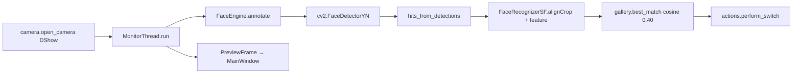
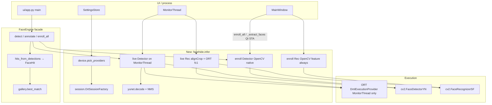
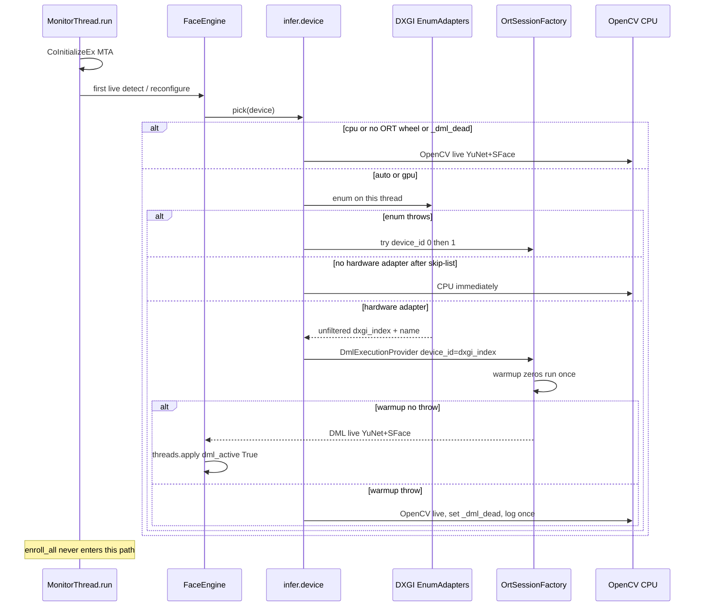
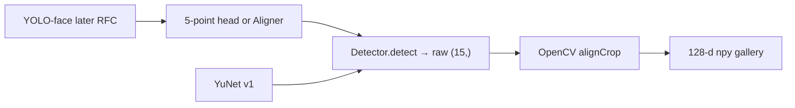

# GPU-Accelerated Inference for FaceHide (当面隐藏)

| Field | Value |
| --- | --- |
| **Status** | Draft |
| **Date** | 2026-09-03 |
| **Author** | FaceHide engineering |
| **Repo** | `E:\workspace\face-hide` |
| **Audience** | Senior engineers familiar with `src/facehide/` |

---

## Overview

FaceHide is a Windows-only tray app that watches a webcam, matches registered faces with **SFace cosine similarity** (gallery `.npy` vectors, default threshold **0.40**), and then hides entertainment windows / opens work apps. Live inference today is a lock-guarded `FaceEngine` wrapping OpenCV `FaceDetectorYN` (YuNet) + `FaceRecognizerSF` (SFace). That stack is commercially stuck on **CPU**: the pip `opencv-python` 5.0.0 wheel’s new graph engine ignores OpenCL/Vulkan/CUDA (`Targets are not supported by the new graph engine for now`), and forcing the classic engine with `OPENCV_FORCE_DNN_ENGINE=1` breaks YuNet (`Input shape redefinition is not allowed`).

This design replaces the **inference backend**, not the product. **Live** detection + recognition move to **ONNX Runtime with the DirectML execution provider** (DX12, NVIDIA/AMD/Intel, no CUDA Toolkit / cuDNN / Visual Studio on the user’s PC), using the **same bundled ONNX files**. **Upload/capture enroll** keeps today’s OpenCV `FaceDetectorYN` native-`setInputSize` path so a high-res group photo still finds small faces. OpenCV also stays for camera I/O, resize, drawing, NMS, `alignCrop`, and the full CPU fallback. Gallery identity, `0.40` cosine matching, auto-enroll, confirm/cooldown, `--check` / `--dev` / `--minimized`, tray, and single-instance behavior are unchanged.

YOLO is **not** a v1 requirement. The detector is abstracted so a later PR can add a YOLO-face backend that still feeds **SFace** (and therefore the existing gallery). YOLO is unnecessary for GPU: YuNet + SFace already run as ONNX on DirectML.

---

## Background & Motivation

### Current data path



| Piece | Location | Behavior |
| --- | --- | --- |
| Live tick | `monitor.py` `MonitorThread.run` | Visible 50 ms, hidden 200 ms. Re-reads `SettingsStore.loop_settings()` every frame. `annotate` / `detect` are **not** in a try/except — only `perform_switch` is. |
| Detect size | `engine.py` `DETECT_MAX_SIDE = 320` | `working_view` shrinks the long side to 320. Enroll (`enroll_all`) does **not** pass `max_side` → native resolution `setInputSize`. |
| YuNet | `FaceEngine._ensure_unlocked` | `FaceDetectorYN.create(..., (320,320), score=0.7, nms=0.3, top_k=5000)` then `setInputSize((w,h))` and `setScoreThreshold` every call. |
| SFace | `FaceEngine.detect` inner `feature_fn` | Increments `extract_count`; `rec.alignCrop(src, raw)` on the **original** BGR using the 15-col YuNet row, then `rec.feature`. |
| Enroll UI | `main_window.py` `_extract_faces` | `return self.engine.enroll_all(bgr)` — uploads and capture both hit this. |
| Gallery | `gallery.py` | `.npy` float32 vectors, `cosine_similarity` (L2-normalizes at compare time). Changing embedding space invalidates the gallery. |
| Models | `models.py` | Exact names `face_detection_yunet_2023mar.onnx` (233 KB) and `face_recognition_sface_2021dec.onnx` (37 MB). |

`actions.py` already splits **pure planning** (`plan_switch`) from **side-effectful execution** (`perform_switch`) with deferred `win32` imports so tests need no OS. Inference must follow that pattern: decode, pad, device policy, and session creation are unit-testable with stubs; DirectML is an execution detail.

### Why OpenCV cannot be the GPU path

Measured on this machine (2026-09-03), Python 3.14.7, `opencv-python` **5.0.0**, RTX 3060 Ti, driver `30.0.14.7212` (GeForce 472.x):

| Observation | Result |
| --- | --- |
| `cv2.cuda.getCudaEnabledDeviceCount()` | `0` (CUDA not compiled into the wheel) |
| OpenCL | YES (NVD3D11); device name matches the NVIDIA GPU |
| `FaceDetectorYN.create(..., backend_id, target_id)` | OpenCV 5 graph engine **CPU-only**. OpenCL/Vulkan/CUDA logs are ignored; timings identical (~3.5–4 ms YuNet, ~6 ms SFace) |
| `OPENCV_FORCE_DNN_ENGINE=1` | YuNet fails: `Input shape redefinition is not allowed` in DataLayer |
| Thread cap (YuNet) | 24 threads 4.02 ms, 8 threads 3.09 ms, 4 threads 3.53 ms, 1 thread 5.26 ms |
| Default `cv2.getNumThreads()` | **24**; NumPy 2.5.2 / OpenBLAS `MAX_THREADS=24` |

High CPU occupancy is **oversubscription**, not model cost. Capping threads is a required **complement** (copy/resize/Qt still share the machine with games). It is not a GPU architecture. The user rejected “just cap OpenCV threads.”

The shipped YuNet ONNX is **static 640×640**. OpenCV classic DNN silently redefines that input when `setInputSize` runs; OpenCV 5’s graph/ORT engine cannot. Any GPU runtime we pick must treat 640×640 as the native graph, or we must re-export a dynamic-shape twin.

### Commercial constraints (non-negotiable)

- Windows 10/11 consumers. GPUs are NVIDIA, AMD, or Intel iGPU. **No CUDA Toolkit, cuDNN, or Visual Studio on the user’s machine.**
- Frozen installer (`pack/build.py` + Inno Setup) must keep working; runtimes must be PyInstaller-bundlable.
- Python **3.10–3.14** remains a source-run goal. CI packages with **3.12**. `onnxruntime-directml` **1.24.4** ships cp311–cp314 `win_amd64` wheels (`Requires-Python >=3.11`). Source **3.10** has no DML wheel under that pin → OpenCV CPU. Do **not** special-case 3.14 onto CPU ORT.
- Existing gallery `.npy` + threshold 0.40 must keep matching. **No re-enrollment in v1.**
- `--check`, `--dev`, `--minimized`, tray, single-instance, auto-enroll, `confirm_frames`, cooldown, `protected_pids={os.getpid()}` stay.
- Tests: stdlib `unittest` only; skip when models/GPU are missing (today’s `test_engine.py` pattern).
- New UI strings: `i18n.t`, **both** `zh` and `en` (`test_i18n.py` asserts identical key sets).
- Faces and embeddings stay on-box. No cloud inference.

---

## Goals & Non-Goals

### Goals

1. Run **live** YuNet detection and SFace recognition on GPU via DirectML when a DX12 **hardware** adapter is usable.
2. **Reliable CPU fallback** that preserves today’s OpenCV live path (`DETECT_MAX_SIDE = 320`) and today’s **native-`setInputSize` enroll** (upload/capture).
3. Keep the public `FaceEngine.detect` / `annotate` / `enroll` / `enroll_all` contract, `FaceHit` 15-col `raw` layout, `extract_count`, and gallery cosine space.
4. Persist a device policy (`auto` / `gpu` / `cpu`) in `Settings`; apply it without restarting the process when practical.
5. Cap OpenCV / ORT / OpenBLAS threads even on GPU.
6. `--check` prints selected EP, DXGI adapter **name + unfiltered index**, and timed detect/recognize on a blank frame. A packed `console=False` exe still shows that text (`AttachConsole` / `CONOUT$`). Dev overlay can show the backend.
7. Package a **tested pin** of `onnxruntime-directml` into the existing PyInstaller + Inno Setup pipeline. Refuse to ship an advertised GPU build whose packed ORT lacks `DmlExecutionProvider`.

### Non-Goals (v1)

- Replacing SFace with ArcFace / buffalo_l / InsightFace (would invalidate `%LOCALAPPDATA%\FaceHide\gallery\*.npy`).
- Making YOLO the default or required detector.
- CUDA / TensorRT / `onnxruntime-gpu` as a supported end-user path.
- Self-building OpenCV with CUDA.
- Cloud, batch, or multi-camera inference.
- Changing match threshold semantics, auto-enroll, or window-switching.
- Adding pytest, new linters, or a Linux/macOS runtime.
- Shipping a second installer SKU in v1.
- Hybrid CPU-YuNet + DML-SFace as the v1 headline (measured follow-up, PR 5b).
- Windows ML / WASDK in the frozen app.

---

## Key Decisions

| # | Decision | Rationale |
| --- | --- | --- |
| K1 | **v1 GPU runtime = ONNX Runtime + DirectML EP**; CPU fallback = current OpenCV YuNet/SFace. | DirectML is DX12, vendor-neutral, redistributable, no CUDA. Same ONNX files already bundled. OpenCV 5 pip wheels cannot GPU-accelerate `FaceDetectorYN`. |
| K2 | **Do not replace SFace.** Gallery `.npy` and 0.40 cosine stay. | Changing embedding space forces re-enrollment; commercially unacceptable for v1. |
| K3 | **YOLO is a future `Detector` backend, not v1.** GPU does not need YOLO. | YuNet is already ONNX. YOLO adds PyTorch/Ultralytics weight, still needs 5-point landmarks for `alignCrop`. v1 `Detection.raw` is always 15-col; empty landmarks are not a v1 API. |
| K4 | **Split live vs enroll detection.** Live ORT YuNet feeds the exported **640×640** via top-left scale + **right/bottom zero-pad** (not centered letterbox). Do not `setInputSize` on DML. **`enroll` / `enroll_all` always use OpenCV `FaceDetectorYN` at native `setInputSize`.** CPU live stays `DETECT_MAX_SIDE = 320`. Auto-enroll-from-monitor uses live detect (webcam scale) — acceptable. | `MainWindow._extract_faces` → `enroll_all` on uploads. A 4000×3000 group photo letterboxed to 640 misses small faces that today’s `setInputSize((w,h))` finds. Webcam capture ~640×480 is fine on either path. This is a gallery-population bug if left on ORT-640. |
| K5 | **Device policy: `auto` (default) → try GPU → CPU.** Fail closed to CPU for the **process lifetime** via `_dml_dead`; do not retry every frame; do not persist the fallback into `config.json`. User combo `gpu` / `reconfigure("gpu")` **clears** `_dml_dead`. Catch ORT errors **inside** backend `run`, not by calling `reconfigure()` under `FaceEngine._lock` (non-reentrant; `MonitorThread.run` does **not** wrap `annotate`). | A sticky `cpu` write would strand users after a driver blip. `gpu` still must not crash the QThread. Nested `detect` → `reconfigure` deadlocks today’s `threading.Lock`. |
| K6 | **DXGI picker skips virtual adapters. `device_id` is the unfiltered `EnumAdapters` ordinal.** If skip-list leaves **no** hardware adapter, go **CPU immediately** (never probe 0). Probe `0` then `1` **only** when DXGI enum itself throws. Persist `{adapter_name, dxgi_index, dedicated_bytes}` on `BackendInfo`. | GameViewer / Basic Render are DXGI `0` on this machine and on GitHub `windows-latest`. Compacted index `0` after filtering would still bind DML to the virtual adapter if the RTX is DXGI `1`. |
| K7 | **v1 cascade is DML YuNet+SFace *or* full OpenCV CPU.** Hybrid CPU YuNet + DML SFace is **PR 5b** after measuring YuNet-DML, not the v1 headline. | SFace is the heavy net, but shipping three backends untested is how hybrid lands broken. `uses_fixed_input` is True only for ORT YuNet. |
| K8 | **Live ORT path keeps `FaceRecognizerSF.alignCrop`; only live `feature()` is ORT `fc1`.** Enroll `embed` is OpenCV `feature()` on the GUI thread — never `session.run`. Do not L2 in the recognizer. NumPy Umeyama is test-only until max abs pixel diff vs `alignCrop` is ≤ 1. | Creating DML/`ID3D12` on a worker and `run`ning it on Qt STA (enroll) plus `MonitorThread` is a known crash class (472.x is R1). `_lock` is not thread affinity. Same-row OpenCV vs ORT `fc1` ≥ 0.99 and jittered-box ≥ 0.40 already gate mixed gallery. Extra ~37 MB RAM for OpenCV SFace is acceptable. |
| K9 | **Thread cap at process start.** `FACEHIDE_THREADS` (default 4, clamp 1–8) **overwrites** `OMP/OPENBLAS/MKL/NUMEXPR` — do not `setdefault`. Env vars only in `pack/entry.py` and `src/facehide/__main__.py` **before** importing `facehide.ui.app`. `threads.apply(dml_active=False)` after import from `main()`; **call again** from `_ensure_unlocked` when live DML comes up (OpenCV threads **1–2**). | `ui/app.py` imports `cv2` at module level. `dml_active` is unknown until `MonitorThread` picks a backend. `setdefault` vs `cv2.setNumThreads(4)` would be inconsistent. |
| K10 | **Depend on `onnxruntime-directml>=1.22,<1.25; platform_system=="Windows" and python_version>="3.11"`.** Tested: **1.24.4** has cp311–cp314 `win_amd64`. **No 3.14 CPU-only marker.** Frozen CI stays 3.12. Local 3.14 packs must get DML. Uninstall `onnxruntime` first. 3.10 `pip install -e .` skips the extra and stays OpenCV CPU. `pack/build.py` **fails** if `DmlExecutionProvider` is missing. | Without `python_version>="3.11"`, pip on 3.10 tries the pin and **fails the whole editable install**, or silently gets an older cp310 DML than CI’s 1.24.4. R5 is **3.10**, not 3.14. |
| K11 | **Do not adopt Windows ML / WASDK in v1.** Revisit as a v2 EP behind the same session factory. | Learn docs: self-contained Python deployment is not applicable. PyInstaller + WASDK is a release risk. DirectML ships as one wheel. |
| K12 | **Expose Auto / GPU / CPU on 识别设置 in v1.** Default `auto`. Persist via `store.get()` → mutate → `replace()` in `_collect_settings` / `reload_all` / `_apply_language`. | Hidden flags are not enough for a tray app. Combo that never writes `inference_device` is a silent no-op. |
| K13 | **Sanitize SFace ONNX** with ORT’s `onnxruntime/tools/python/remove_initializer_from_input.py` algorithm into `%LOCALAPPDATA%\FaceHide\models\face_recognition_sface_2021dec.ortin.onnx`. Lazy-import `onnx`; on `ImportError` use the unsanitized file (session already exposes only `data`). Do **not** add `onnx` as a hard runtime dep. | MXNet export lists weights as `graph.input` (including `scalar_op1=127.5` / `scalar_op2=0.0078125`). A “tiny protobuf rewrite” is not a plan. |
| K14 | **Create and `run` DML only on `MonitorThread`.** `CoInitializeEx(NULL, COINIT_MULTITHREADED)` at the start of `MonitorThread.run`; never CoInit the Qt GUI thread (Qt already owns STA). No separate warmup worker. First live tick may compile (~100–500 ms) on that QThread — emit `status`, skip the rest of the tick. `--check` has no `QApplication` and may create DML on its process main thread. Packed `--check`: prefer `AttachConsole(-1)`; else `AllocConsole`; then `sys.stdout = sys.stderr = open("CONOUT$", "w", encoding="utf-8", errors="replace")`. | DML/`ID3D12` is not apartment-portable. `MainWindow._start_preview` already starts `MonitorThread` ~200 ms after show (`main_window.py`), even when unarmed — that is the infer thread. Frozen `console=False` leaves `sys.stdout is None`; AllocConsole without `CONOUT$` still drops `print()`. |
| K15 | **v1 `Detection.raw` is always shape `(15,)` float32** in the coordinate space of the BGR passed to `Detector.detect` (640-canvas unpadded **before** `hits_from_detections`). Facade stacks rows and keeps `extract_count` in `feature_fn`. | `hits_from_detections` treats `faces` as `(N,15)`. `np.asarray(list[Detection])` is not that. Leaking canvas coords into `alignCrop(src, raw)` silently drifts SFace. |

---

## Proposed Design

### Architecture



`FaceEngine` remains the only type `MonitorThread`, `MainWindow`, and `ui/app.py` construct. Internally it holds **two** `Detector`s and **two** `Recognizer`s behind `threading.Lock`:

- `_enroll_det` / `_enroll_rec`: always OpenCV YuNet + OpenCV `alignCrop`/`feature`. Called from the **Qt GUI thread** (`_extract_faces`). Never `session.run`.
- `_live_det` / `_live_rec`: ORT YuNet + OpenCV `alignCrop` + ORT `fc1` when DML is up, else the same OpenCV pair. **Created and `run` only on `MonitorThread`.**

Stub `InferenceFn` is treated as cross-thread-safe under `_lock` in tests. Real DML is **not** assumed to be; the lock only prevents concurrent `run`, it does not provide COM affinity.

### Module map (new)

| Module | Role | Side effects |
| --- | --- | --- |
| `facehide/threads.py` | `apply_env()` is **not** called from here at import time. `apply()` sets `cv2.setNumThreads` + ORT intra after imports. | `cv2.setNumThreads` |
| `facehide/infer/types.py` | `Detection`, `BackendInfo`, `DeviceChoice`, protocols | None |
| `facehide/infer/preprocess.py` | Top-left scale-to-fit + right/bottom zero-pad to 640; BGR NCHW float32 `[0,255]`; unpad | None |
| `facehide/infer/yunet.py` | 2023mar decode, score `sqrt(cls*obj)`, NMS | `cv2.dnn.NMSBoxes` only |
| `facehide/infer/align.py` | Optional golden clone of `alignCrop` (tests). **Not** the v1 production path. | `cv2.warpAffine` |
| `facehide/infer/session.py` | `InferenceFn` protocol, `OrtSessionFactory`, SFace sanitize | File cache under `models_dir()` |
| `facehide/infer/device.py` | DXGI enum + skip-list, `_dml_dead`, provider pick | DXGI/ctypes; COM only on infer thread |
| `facehide/infer/opencv_backend.py` | Wrap `FaceDetectorYN` (`setInputSize`, `setScoreThreshold`) / `FaceRecognizerSF` | OpenCV create |
| `facehide/infer/ort_backend.py` | ORT YuNet detect + ORT SFace `fc1`; `alignCrop` delegated to OpenCV | ORT session create |
| `engine.py` | Facade; `_dml_dead` rebuild on `_ensure_unlocked`; `reconfigure(device)` | Delegates |

Do **not** put ORT imports in `engine.py` at module level. Follow `actions._win32()`: `import onnxruntime` happens inside the factory so tests on a machine without the wheel still collect.

`pack/entry.py` and `src/facehide/__main__.py` inline the env-var pin **before** `from facehide.ui.app import main`. They must not import `threads.py` first if that file ever imports `cv2`. `__main__.py` today is `from facehide.ui.app import main` at module level — PR 1 changes that.

### Protocols (planning vs execution)

```python
class InferenceFn(Protocol):
    def run(
        self,
        output_names: list[str] | None,
        input_feed: dict[str, np.ndarray],
    ) -> list[np.ndarray]: ...

@dataclass(frozen=True)
class Detection:
    box: tuple[float, float, float, float]  # x, y, w, h in detector-input image space
    score: float
    raw: np.ndarray  # shape (15,) float32; YuNet layout; same image space as `box`

class Detector(Protocol):
    uses_fixed_input: bool  # True only for ORT YuNet 640; False for OpenCV YuNet
    def detect(self, bgr: np.ndarray, score_threshold: float) -> list[Detection]: ...
    def info(self) -> BackendInfo: ...

class Recognizer(Protocol):
    def embed(self, bgr: np.ndarray, raw_row: np.ndarray) -> np.ndarray: ...
    def info(self) -> BackendInfo: ...

@dataclass(frozen=True)
class BackendInfo:
    detector: str
    recognizer: str
    provider: str
    device_name: str
    dxgi_index: int | None
    dedicated_bytes: int | None
    fallback: bool
```

v1: `raw` is **always** 15-col. There is no “empty landmarks” branch. A later YOLO backend that cannot fill `raw[4:14]` with real 5-points **cannot** implement `Detector` until it has a 5-point head or a separate `Aligner` (hard gate in that RFC).

Tests pass a stub `InferenceFn` (same idea as `notify.py` `JsonFn`). They never create a real `InferenceSession`. YuNet decode is tested with synthetic `cls/obj/bbox/kps` tensors.

### FaceEngine facade

`FaceEngine.__init__` gains optional `device: str = "auto"` and `session_factory`. Defaults preserve today’s constructor used by `ui/app.py` and `tests/test_engine.py`.

`detect` **must** keep calling `working_view` and `hits_from_detections` — `test_engine.py` uses `inspect.getsource(FaceEngine.detect)` and asserts those names. `enroll_all` must still contain `extract_features=True` and **must not** contain the token `max_side` (a comment that says `max_side` fails `test_enroll_stays_on_native_resolution`).

`MonitorThread.run` must still pass `max_side=plan.detect_max_side` (`plan_tick` stays 320). The ORT live detector ignores that value because `uses_fixed_input` is True → facade passes `side=0` into `working_view`. Do not “clean up” the monitor argument later; `test_plan_uses_downscaled_detect_side` and `inspect.getsource(MonitorThread.run)` (`detect_max_side`, `plan_tick`, `loop_settings`, `extract_features`, no `cvtColor`) depend on it.

```python
def detect(self, bgr, extract_features=True, *, max_side: int = 0, for_enroll: bool = False) -> list[FaceHit]:
    with self._lock:
        self._ensure_unlocked()
        det = self._enroll_det if for_enroll else self._live_det
        side = 0 if (for_enroll or det.uses_fixed_input) else max_side
        work, scale_x, scale_y = working_view(bgr, side)
        detections = det.detect(work, float(self.detect_score))
        if not detections:
            faces = None
        else:
            faces = np.stack([d.raw for d in detections]).astype(np.float32)  # (N, 15)
        src = bgr
        rec = self._enroll_rec if for_enroll else self._live_rec
        engine = self

        def feature_fn(raw: np.ndarray) -> np.ndarray:
            engine.extract_count += 1
            return rec.embed(src, raw)  # enroll: OpenCV feature; live: ORT fc1 on MonitorThread only

        return hits_from_detections(
            faces,
            scale_x=scale_x,
            scale_y=scale_y,
            extract_features=extract_features,
            feature_fn=feature_fn,
        )

def enroll_all(self, bgr: np.ndarray) -> list[tuple[np.ndarray, np.ndarray]]:
    hits = self.detect(bgr, extract_features=True, for_enroll=True)
    ...
```

`OpenCvYunetDetector.detect` calls `setScoreThreshold` and `setInputSize((width, height))` of the array it received — same as today’s `_ensure_unlocked` + `detect` body.

`Detection.raw` / `box` are in **`work` space** (the BGR passed to `Detector.detect`). ORT YuNet unpads 640-canvas → `work` **inside** the backend, before returning. `hits_from_detections` then applies `scale_x/scale_y` (`work` → original `bgr`). `feature_fn` therefore always sees a 15-col row in **original-image** pixels for `alignCrop(src, raw)`. Canvas coordinates must never reach `FaceHit` or SFace.

`reconfigure(device: str)` takes `_lock`, clears `_dml_dead` when the user asked for `gpu` or `auto`, disposes **live** DML sessions, and rebuilds. `MonitorThread` already reopens the camera when `loop.camera_index` changes; add `inference_device` to `LoopSettings` and do the same. Recreate is ~100–500 ms (DML compile) on the **monitor QThread only**. Emit `status` (`log.infer_gpu` / `log.infer_cpu`), reset streak, and skip remaining work that tick. Do **not** create or `run` DML from `main()`, a warmup worker, or `_extract_faces`.

`_ensure_unlocked` (called from `detect` under `_lock`):

- If this call is `for_enroll`: ensure OpenCV enroll backends only. Never open a DML session.
- If this call is live and the caller is not `MonitorThread`: must not happen in v1. Live `annotate`/`detect` is only invoked from `MonitorThread.run`.
- If `_dml_dead` and live backends are still DML, swap `_live_det` / `_live_rec` to OpenCV **without** calling `reconfigure()`.
- First live tick: DXGI enum + `CoInitializeEx` + DML `InferenceSession` + zeros warmup `run` happen here, on `MonitorThread`. Then `threads.apply(dml_active=True)`.

`MonitorThread.run` starts with `CoInitializeEx(NULL, COINIT_MULTITHREADED)` and `CoUninitialize` in `finally`. Do **not** CoInit the GUI thread. `--check` CoInits its own process main thread (no Qt).

### Live vs enroll (gallery population)

| Call site | Thread | Detector | Embedder | Input size |
| --- | --- | --- | --- | --- |
| `MonitorThread` `annotate` / live `detect` | `MonitorThread` (infer) | `_live_det` (ORT 640 or OpenCV 320) | `_live_rec` (ORT `fc1` or OpenCV `feature`) | Webcam, typically 640×480 |
| `enroll` / `enroll_all` / `_extract_faces` | Qt GUI (STA) | `_enroll_det` = OpenCV YuNet **always** | `_enroll_rec` = OpenCV `feature()` **always** | Native photo / capture frame |
| `enroll_unknown_faces` (auto-enroll) | `MonitorThread` | Live hits already computed | `_live_rec` | Webcam-scale — **acceptable** |

OpenCV-enrolled `.npy` vs ORT-live `fc1` is gated by the jittered-box cosine ≥ 0.40 test (and `--check` same-row ≥ 0.99). v1 does **not** marshal enroll `embed` onto `MonitorThread`; that would block the GUI on DML compile and reintroduce affinity bugs. If a later PR needs ORT `fc1` at enroll time, it must queue work onto the infer thread and never `session.run` on STA.

### YuNet ONNX I/O (measured, this repo’s file)

`C:\Users\ethan\AppData\Local\FaceHide\models\face_detection_yunet_2023mar.onnx`:

| | |
| --- | --- |
| Input | `input` float32 **`[1, 3, 640, 640]`** NCHW, **opset 11**, PyTorch 1.7 |
| Outputs | `cls_{8,16,32}`, `obj_{8,16,32}`, `bbox_{8,16,32}`, `kps_{8,16,32}` |
| Spatial | stride 8 → 80×80 = 6400; 16 → 40×40 = 1600; 32 → 20×20 = 400 |

Opset 11 is inside the DirectML EP’s advertised range (~opset 20). If `--check` warmup succeeds but **`--check` cross-cosine** fails, treat that as fallback for the `--check` process — `ORT_ENABLE_ALL` can run wrong without throwing. GUI start does **not** download lena or compute cross-cosine.

OpenCV `FaceDetectorYN` (4.x `face_detect.cpp`) does **not** use the older 2021/2022 prior-box (`loc/conf/iou`) decoder for this file. The 2023mar path is:

1. `padW = ((inputW - 1) // 32 + 1) * 32` (same for H). For 640, pad = 640.
2. `blobFromImage(pad_image)` with **defaults**: scale 1.0, mean 0, **`swapRB=false`**, crop false → **BGR** NCHW float32 in `[0, 255]`. PhotoPrism’s face package independently confirmed this against OpenCV source: YuNet is BGR; SFace is RGB.
3. For each stride, cell `(r, c)`:
   - `score = sqrt(clamp01(cls) * clamp01(obj))`
   - `cx = (c + bbox[0]) * stride`, `cy = (r + bbox[1]) * stride`
   - `w = exp(bbox[2]) * stride`, `h = exp(bbox[3]) * stride`
   - `x1, y1 = cx - w/2, cy - h/2`
   - landmark `n`: `((kps[2n] + c) * stride, (kps[2n+1] + r) * stride)`
4. Drop `score < detect_score` (default 0.7), NMS at 0.3, `top_k=5000`.
5. Emit a 15-col row: `x, y, w, h, re, le, nose, rmouth, lmouth, score`.

NMS: boxes as `[x, y, w, h]`, score threshold 0.7, nms 0.3, top_k 5000. `cv2.dnn.NMSBoxes` index types differ across OpenCV 4/5 — **normalize the return to `list[int]`** before indexing.

### Live ORT preprocess (not centered letterbox)

OpenCV pads **bottom/right** with 0 after (optionally) placing the image at the **top-left**. Centered letterbox (80 px top and bottom on a 640×480 frame) is a **different** transform and must not be used.

v1 live ORT pad, for camera-sized frames:

1. Let `(h, w)` be the live frame (after `working_view` with `side=0`, i.e. native).
2. `scale = min(1.0, min(640 / w, 640 / h))` — **never upscale**. 640×480 → `1.0`; 1280×720 → `640/1280 = 0.5`; **320×240 → `1.0`** (not 2.0).
3. Resize to `(round(w*scale), round(h*scale))` with `INTER_AREA` **only if `scale < 1`**. If `scale == 1`, skip resize (320×240 stays 320×240 on the canvas).
4. Place at **(0, 0)** on a 640×640 zero canvas; remainder is **right and bottom** pad. Default 640×480 → 160 px **bottom** pad, not 80/80. 320×240 → 320 px right + 400 px bottom.
5. `blob` = BGR NCHW float32 `[0,255]`, no `swapRB`.
6. Unpad with the **same** `scale` you applied: `x_work = x_canvas / scale` (origin (0,0); no center offset). For 320×240, `scale == 1` so this is identity — never ÷2.

Unit-test invert for **320×240**, **640×480**, and **1280×720**, not only 640×480.

Do **not** upscale a 320 `working_view` to 640 (strategy E). CPU live stays 320.

opencv_zoo’s `face_detection_yunet_2026may.onnx` is the **same weights** with symbolic H/W. v1 does **not** ship it.

**Golden test (when models exist):** pad/resize the **same** array to 640×640, run OpenCV `FaceDetectorYN.setInputSize((640, 640))` vs ORT, assert IoU ≥ 0.9 and landmark L2 within a few px. Do **not** compare raw `lena.jpg` @ 512×512 (`setInputSize(512,512)`, 512÷32=16, no pad) to ORT@640 — boxes will not match. Unit-test unpad invert on synthetic **320×240**, **640×480**, and **1280×720** frames.

### SFace ONNX I/O (measured)

`face_recognition_sface_2021dec.onnx`:

| | |
| --- | --- |
| Session input | `data` float32 `[1, 3, 112, 112]` (ORT hides weight initializers) |
| Output | `fc1` `[1, 128]` |
| Graph preprocess | `scalar_op1=127.5`, `scalar_op2=0.0078125` → `(x - 127.5) / 128` **inside the net** |

OpenCV `FaceRecognizerSF` (`face_recognize.cpp`):

- `alignCrop`: 5 points from `face_mat[4:14]`, `getSimilarityTransformMatrix` (5-point Umeyama/SVD) to `{38.2946,51.6963}, {73.5318,51.5014}, {56.0252,71.7366}, {41.5493,92.3655}, {70.7299,92.2041}`, `warpAffine(..., (112,112), INTER_LINEAR)`.
- `feature`: `blobFromImage(aligned, 1, (112,112), 0, swapRB=true, crop=false)` → **RGB** `[0,255]` NCHW. The ONNX graph does mean/scale. **No L2** in `feature()`; FaceHide L2s only in `gallery.cosine_similarity`.

v1 `OrtSfaceRecognizer.embed` (**MonitorThread only**):

1. `aligned = self._cv_rec.alignCrop(bgr, raw_row)`  # always OpenCV
2. `blob = cv2.dnn.blobFromImage(aligned, 1, (112, 112), (0, 0, 0), swapRB=True, crop=False)`
3. `fc1 = inference.run(None, {"data": blob})[0]` → `float32` shape `(128,)`, **not** L2-normalized

`OpenCvSfaceRecognizer.embed` (GUI enroll and CPU live): OpenCV `alignCrop` + OpenCV `feature()`, no ORT.

ORT SFace must feed RGB `[0,255]`, not `/255`, not pre-subtracted.

Sanitize once to `face_recognition_sface_2021dec.ortin.onnx` using the same rewrite as `onnxruntime/tools/python/remove_initializer_from_input.py`. Lazy `import onnx`; on `ImportError`, open the canonical file (ORT 1.29 already exposes only `data` via `get_inputs()`, with noisy initializer warnings). Canonical HuggingFace/opencv_zoo file stays the source of truth for `ensure_models()` and the installer.

Parity tests (models present, ORT importable; skip otherwise):

1. Same 15-col row → OpenCV `feature` vs ORT `fc1` cosine **≥ 0.99**.
2. OpenCV-enroll feature vs ORT-embed on a **slightly jittered box** still **≥ 0.40** (mixed-gallery / live-box-jitter, not one lena pair at 0.90).
3. `--check` cross-cosine ≥ 0.90 on lena **only when** `import onnxruntime` works.

### Fixed 640×640 vs dynamic vs hybrid

| Strategy | Pros | Cons | v1 |
| --- | --- | --- | --- |
| **A. Top-left + bottom/right pad to exported 640×640, one DML session, live only** | Fixed graph; DML-friendly; 640×480 is native pixels + 160 px bottom pad | GPU live boxes ≠ CPU 320 path | **Adopt for live** |
| **A2. Enroll always OpenCV native `setInputSize`** | Uploads keep small faces; `enroll_all` contract | Two detectors in `FaceEngine` | **Adopt** |
| B. Recreate session on every `setInputSize` | Matches OpenCV API | DML compile per resolution is unusable | Reject |
| C. Ship 2026may dynamic dims | True `setInputSize` on ORT CPU | DML dynamic-shape risk | Defer |
| D. CPU YuNet + GPU SFace | Smallest GPU win if YuNet-DML is slow | Third backend; `uses_fixed_input` mix | **PR 5b**, not v1 headline |
| E. Keep 320 `working_view` then **upscale** to 640 | Reuses `plan_tick.detect_max_side` | Interpolated pixels | Reject |

Live camera default is already 640×480 (`Settings.frame_width/height`). CPU path is **not** moved to 640: ORT-CPU YuNet 640 measured **7.2 ms** vs OpenCV YuNet 320 at **~3.5–4 ms**.

### Device policy and DXGI



`Settings.inference_device: str = "auto"` with `INFERENCE_DEVICES = ("auto", "gpu", "cpu")`. Unknown values coerce to `"auto"` in `settings_from_dict` (same style as `notify_template`). Unit-test that coerce.

Fallback rules:

- GPU init or first warmup zeros `run` throw → set `_dml_dead=True`, log once (`log.infer_fallback`), OpenCV live for the process, do **not** retry next frame. Cross-cosine is **`--check` only** (needs lena / a real face); do not fetch lena at GUI start.
- User setting `gpu` still falls back (never crash). Setting remains `gpu` on disk so the **next launch** retries. In-process, only `reconfigure("gpu")` / combo change to GPU or Auto clears `_dml_dead`.
- User setting `cpu` never touches DML.
- `auto` equals “try GPU, accept CPU.”

Adapter skip list (case-insensitive substring): `GameViewer`, `Basic Render`, `Remote`, `Virtual`, `Microsoft Basic Display`. Prefer the remaining adapter with the most dedicated memory, else any hardware adapter.

**`device_id` is the original DXGI index**, not the index in the filtered list.

Unit test (`tests/test_device.py`, fake adapter list, no DXGI):

- Input `[GameViewer, RTX 3060 Ti]` → pick `device_id=1`, never `0`.
- Input `[Basic Render]` only → CPU, do not probe DML.
- DXGI enum raises → try 0 then 1 then CPU.

COM: `CoInitializeEx(NULL, COINIT_MULTITHREADED)` **only** on `MonitorThread.run` (and on `--check`’s process thread, which never creates `QApplication`). This repo never calls `pythoncom.CoInitialize` today (`hiddenimports` already lists `pythoncom`). `CoUninitialize` in `MonitorThread.run`’s `finally`. **Do not CoInit the GUI thread** — Qt already initialized it as STA. DXGI enum and DML `InferenceSession` construction run on the same infer thread after that CoInit.

ORT session options:

```python
so.intra_op_num_threads = threads.intra_op()  # FACEHIDE_THREADS, default 4
so.inter_op_num_threads = 1
so.graph_optimization_level = ORT_ENABLE_ALL
so.enable_mem_pattern = False  # usual DML advice
providers = [
    ("DmlExecutionProvider", {"device_id": dxgi_index}),  # unfiltered ordinal
    "CPUExecutionProvider",
]
```

Warmup: one `run` on zeros of the fixed shape, **on `MonitorThread` at first live `_ensure_unlocked`** (or on `--check`’s main thread). `--check` reports “first” vs “steady.” No GUI warmup worker. No lena download outside `--check`.

### Mid-run DML failure (lock)

`MonitorThread.run` only wraps `perform_switch` (`src/facehide/monitor.py`). An exception from `annotate` kills the QThread, emits `log.cam_closed`, and watching stops.

Do **not** call `reconfigure()` from `detect` while holding `self._lock` (deadlock). Do **not** switch to `RLock` unless a later PR proves nesting is required.

Contract:

1. `OrtSessionFactory` / backend `run` catches ORT exceptions, sets `engine._dml_dead = True` (or a factory flag the engine reads), returns empty detections / re-raises a **sentinel** the facade converts to empty hits for that frame.
2. Facade stays under one lock acquire. Next `_ensure_unlocked` sees `_dml_dead` and builds OpenCV live+rec.
3. `status.emit(t("log.infer_fallback", error=...))` once.
4. Test: stub `InferenceFn` raises on the **second** `run`; assert the engine’s next `detect` succeeds on CPU and the thread would stay alive.

### Thread cap (even on GPU)

`FACEHIDE_THREADS` default 4, clamp `[1, 8]`.

**Env (must run before numpy/cv2 import):**

```python
# pack/entry.py and src/facehide/__main__.py only
n = clamped_facehide_threads()  # default 4; honor FACEHIDE_THREADS
for key in ("OMP_NUM_THREADS", "OPENBLAS_NUM_THREADS", "MKL_NUM_THREADS", "NUMEXPR_NUM_THREADS"):
    os.environ[key] = str(n)  # overwrite, do not setdefault
```

**After imports** (`threads.apply(dml_active=False)` from `main()` / `run_self_check` — DML is not known yet):

```python
def apply(*, dml_active: bool = False) -> None:
    n = clamped_facehide_threads()
    cv2.setNumThreads(1 if dml_active else n)  # 1–2 when DML; n otherwise
    # ORT SessionOptions.intra_op_num_threads is set at session create (n)
```

Call `threads.apply(dml_active=True)` again from live `_ensure_unlocked` when DML actually comes up (and `dml_active=False` on `_dml_dead` / `reconfigure("cpu")`). `--check` prints the effective OpenCV and ORT intra counts.

### Session lifetime

- Create live YuNet/SFace **DML** sessions once, on `MonitorThread`, at 640×640 / 112×112.
- Always construct OpenCV `FaceDetectorYN` + `FaceRecognizerSF` for enroll (GUI) and as live fallback. Those OpenCV objects may be used from the GUI thread; they are not DML.
- Reuse every tick. Never recreate on camera frame size changes.
- Recreate live DML on `reconfigure()` (user combo) or `_dml_dead` swap inside `_ensure_unlocked`, still on `MonitorThread`.
- No warmup worker in `main()`. `MainWindow._start_preview` already starts `MonitorThread`; first live tick warms up.

### Monitor / settings live apply

Add to `LoopSettings` (`config.py`): `inference_device: str`. Constructed only in `SettingsStore.loop_settings()` (frozen dataclass; `tests/test_config.py` goes through the store).

`MonitorThread.run` compares `loop.inference_device` to `self._opened_device` like `camera_index`. On change: `self._engine.reconfigure(...)`, reset streak, `status.emit`, skip the rest of that tick.

`detect_score` stays config-only (already live-applied; not in the settings UI).

### UI and i18n

Combo on `_build_settings` **next to the camera row** in `ui/main_window.py`.

Persist path (easy to miss — the combo is a no-op without all three):

- `_collect_settings`: `settings.inference_device = selected`
- `reload_all`: set combo from `settings.inference_device`
- `_apply_language`: combo labels via `t(...)`
- `_save_from_ui`: existing `store.get()` copy → `_collect_settings` → `store.replace()`

Strings (both `zh` and `en`):

- `settings.device` / `settings.device_auto` / `settings.device_gpu` / `settings.device_cpu`
- `settings.device_hint`
- `log.infer_gpu`, `log.infer_cpu`, `log.infer_fallback` (`{error}`)
- `preview.dev4`: `推理 {backend} · {device}` / `Infer {backend} · {device}`

Fourth HUD line **only** when `frame.dev_mode` (existing `_render_preview` pattern). `PreviewFrame` fields `backend: str = ""`, `infer_device: str = ""` (keyword-construct tests keep working).

**Screenshots:** `pack/shots.py` `pages` currently has `("settings", 4)` but `NAV_ITEMS` is monitor/faces/work/hide/**notify**/settings (0–5). Index 4 is **消息渠道**. Same PR as the combo: `("notify", 4), ("settings", 5)`. Do not hand-edit PNGs; regenerate via `pack/shots.py`.

### `--check` additions (`ui/app.py:run_self_check`)

Keep blank-image reject and (when online) lena self-match (`score < 0.6` already). Append when possible:

```
推理设备  auto → DmlExecutionProvider / NVIDIA GeForce RTX 3060 Ti  dxgi=1  dedicated=8GiB
线程     OpenCV 2  ORT intra 4
YuNet    DML 640  first 12.4 ms  steady 2.1 ms  faces=0
SFace    DML 112  first  8.1 ms  steady 1.4 ms
自匹配   OpenCV 0.993  ORT 0.991  cross 0.988
```

Gates:

| Condition | `--check` |
| --- | --- |
| ORT not importable | Print `ORT 未安装`; today’s OpenCV self-match only; exit 0 if that passes |
| ORT importable, DML absent | CPU OpenCV live + ORT-CPU compare if cheap; **do not fail** for missing DML |
| ORT importable | Cross-cosine ≥ 0.90 **and** blank=0 on both backends, or exit non-zero |
| Packed / offline | Lena download **optional**; skip self-match if the sample fetch fails |
| Packed `console=False` | `pack/entry.py` before Qt: if `"--check" in argv`, `AttachConsole(-1)` when a parent console exists (`cmd FaceHide.exe --check`); else `AllocConsole`. Then `sys.stdout = sys.stderr = open("CONOUT$", "w", encoding="utf-8", errors="replace")` (optional `CONIN$`). Frozen windowed Python has `sys.stdout is None`; AllocConsole alone does not reconnect `print()`. |

CI `windows-latest` is fallback-only (Basic Render). `--check` must return 0 there.

### Failure and product behavior

| Event | Behavior |
| --- | --- |
| `onnxruntime` import fails | CPU OpenCV; `--check` prints `ORT 未安装` |
| DML provider missing | CPU OpenCV; packed **GPU** installer build fails in `pack/build.py` |
| DXGI skip-list empty | CPU immediately; no `device_id=0` |
| DXGI enum throws | Probe DML `device_id` 0 then 1, then CPU |
| DML create/warmup throws | `_dml_dead`, CPU OpenCV live, log once, keep watching |
| `--check` warmup ok, cross-cosine fail | `--check` exits non-zero; does **not** run at GUI start |
| Mid-run DML `run` throws | Catch in backend `run`; `_dml_dead`; next `_ensure_unlocked` is OpenCV; **do not** kill `MonitorThread` |
| User switches combo to CPU | `reconfigure("cpu")` on monitor thread |
| User switches combo to GPU after fallback | Clear `_dml_dead`, retry DML |

FaceHide still never minimizes itself (`protected_pids={os.getpid()}`).

---

## YOLO as a future Detector (not v1)

A YOLO-face model can implement the same `Detector` protocol **only if** it produces a 15-col `raw` with real 5-point landmarks, or a later RFC adds a separate `Aligner`. Recognition **stays SFace**.

- `FaceRecognizerSF.alignCrop` reads five points from `FaceHit.raw[4:14]`.
- Box-only YOLO has **no** 5-point head. Fabricating landmarks from the box **poisons** SFace scores; users would think the gallery broke.
- Follow-up order: (1) YOLO-face export **with** 5 landmarks mapped into the YuNet 15-col row; (2) box + PFLD/PIPNet `Aligner`; (3) box-center crop is **not** acceptable.

v1 only ships YuNet. Do not add `ultralytics` or PyTorch to `pyproject.toml`. Empty `landmarks` is **not** a v1 field.



---

## API / Interface Changes

### `Settings` / `LoopSettings` (`config.py`)

```python
INFERENCE_DEVICES = ("auto", "gpu", "cpu")

# Settings
inference_device: str = "auto"

# LoopSettings  (monitor hot path, no deepcopy)
inference_device: str
```

`settings_from_dict` coerces unknown values to `"auto"`. `SettingsStore.get()` still returns copies; `replace()` still deep-copies and writes JSON.

### `FaceEngine` (`engine.py`)

```python
def __init__(..., device: str = "auto", session_factory: OrtSessionFactory | None = None) -> None: ...
def reconfigure(self, device: str) -> BackendInfo: ...
def backend_info(self) -> BackendInfo: ...
def detect(..., for_enroll: bool = False) -> list[FaceHit]: ...
```

No change to `FaceHit`, `DETECT_MAX_SIDE`, `crop_face`, or gallery APIs.

### `PreviewFrame` (`monitor.py`)

`backend: str = ""`, `infer_device: str = ""`.

### `ui/app.py`

`FaceEngine(device=store.get().inference_device)`. No warmup in `main()`. `--check` uses the same factory on its own thread. Packed `--check` console attach + `CONOUT$` is in `entry.py`.

### `pack/entry.py`

If `"--check" in sys.argv`: allocate/attach a console, then pin threads, then `from facehide.ui.app import main`.

### `pack/shots.py`

`pages`: settings index **5**; add notify as **4**.

---

## Data Model Changes

`%LOCALAPPDATA%\FaceHide\config.json` gains:

```json
"inference_device": "auto"
```

Missing key → `auto`. No migration script. Gallery JSON and `.npy` files are **untouched**.

Optional cache (regenerable):

```
%LOCALAPPDATA%\FaceHide\models\face_recognition_sface_2021dec.ortin.onnx
```

---

## Packaging

### Dependency

`pyproject.toml` / `requirements.txt`:

```
onnxruntime-directml>=1.22,<1.25; platform_system=="Windows" and python_version>="3.11"
```

- **One** ORT package per environment. Document: `pip uninstall onnxruntime` before installing FaceHide if CPU ORT is already present (this workspace: `onnxruntime` 1.29.0, providers `AzureExecutionProvider` + `CPUExecutionProvider` only).
- Pin avoids 3.10 pip backing up to an ancient DML **and** CI floating to an untested 1.25+.
- 1.24.4: cp311–cp314 win_amd64; `Requires-Python >=3.11`. The **`python_version>="3.11"` marker is required** so `pip install -e .` on 3.10 skips the extra and stays OpenCV CPU instead of failing the whole install (or pulling an older cp310 DML). README one line.
- Frozen CI: Python **3.12** (keep). Local pack on 3.14.7 currently writes `dist/FaceHide/python314.dll` — that pack **must** contain DML, not CPU ORT.
- `pack/build.py` after Analysis/COLLECT (or a short runtime probe in the build venv): if `"DmlExecutionProvider" not in onnxruntime.get_available_providers()`, **`raise SystemExit`** so we never advertise a GPU installer without DML.
- Do **not** add `onnxruntime-gpu`, CUDA, cuDNN, TensorRT, OpenVINO, or PyTorch. `onnx` is **not** a hard runtime dep (lazy sanitizer).

### PyInstaller (`pack/build.py` `write_spec`)

- `collect_all("onnxruntime")` next to `PySide6`, `cv2`, `numpy`.
- `hiddenimports += ["onnxruntime", "onnxruntime.capi", "onnxruntime.capi._pybind_state"]`.
- After collect, **assert** these names land in the COLLECT tree (fail the build if missing):
  - `DirectML.dll`
  - `onnxruntime_providers_dml.dll` (or `onnxruntime_providers_dml.pyd` / matching wheel name)
  - `onnxruntime_providers_shared.dll`
- Prefer the wheel’s `DirectML.dll` over the OS copy for version alignment.
- Size: DML 1.24.4 wheel **25.6 MB** compressed; unpacked ORT+DirectML ≈ **+20–45 MB**. Modest next to PySide6.
- Models: still only the two ONNX names in `MODEL_NAMES`.

`console=False` stays for the tray UX. `--check` attach/AllocConsole + `CONOUT$` rebind is in `entry.py`, not a second stub exe. PR 7 smokes packed `FaceHide.exe --check` and asserts stdout is non-empty.

CI `.github/workflows/build.yml` stays `python-version: "3.12"`. Treat hosted runners as **fallback-only**; do not claim they have a useful DXGI GPU.

---

## Alternatives Considered

### 1. `opencv-python-cuda` / self-built OpenCV CUDA

NVIDIA-only; CUDA toolkit on the user’s PC; huge PyInstaller payload; Intel/AMD get nothing. **Reject.**

### 2. `onnxruntime-gpu` (CUDA EP)

CUDA/cuDNN version hell; two SKUs. DirectML covers NVIDIA without the toolkit. **Reject.**

### 3. Keep `FaceDetectorYN`, wait for OpenCV 5 GPU graph / ORT engine

Measured now: backends ignored; classic engine breaks YuNet. **Reject** as the GPU plan. Keep OpenCV as CPU fallback **and** as enroll detector / `alignCrop`.

### 4. Ultralytics YOLO-face + PyTorch

Optional **later Detector** with a 5-point hard gate. Not v1. Not required for GPU.

### 5. InsightFace buffalo_l (SCRFD + ArcFace)

Different embedding → re-enroll. **Reject for v1.**

### 6. OpenVINO

Intel-strong; extra runtime. Possible v2 EP (including via WinML on Win11 24H2+). **Not v1.**

### 7. Windows ML / `onnxruntime-windowsml`

Same ORT API; auto EP catalog. WASDK + bootstrap; self-contained Python **not applicable**. **v2** behind `OrtSessionFactory`.

### 8. Thread cap only (rejected by product)

Adopt as K9, not as the GPU design.

### 9. Reimplement `alignCrop` in NumPy for the ORT path

Avoids loading SFace in OpenCV (~37 MB). High risk of Umeyama mismatch. **v1 uses OpenCV `alignCrop`.** NumPy clone is test-only until pixel-diff ≤ 1.

### 10. ORT-640 for enroll as well as live

Breaks multi-face upload on large photos (`_extract_faces` → `enroll_all`). **Reject.** Split detectors (K4).

---

## Security & Privacy

| Topic | Handling |
| --- | --- |
| Data plane | Frames, embeddings, thumbnails stay under `%LOCALAPPDATA%\FaceHide\`. No new network calls. `ensure_models()` still only hits HuggingFace / opencv_zoo for the two ONNX files. |
| DirectML / ORT | Local DX12 compute. They do not upload frames. |
| `--check` lena.jpg | Already downloads a public sample; **optional** when offline / packed smoke. |
| Model integrity | Keep `min_bytes` checks. Sanitized SFace copy is derived locally; if missing/corrupt, rebuild or use canonical. |
| Process isolation | DXGI enum is user-level. `CoInitializeEx(MTA)` on `MonitorThread` / `--check` only — never the Qt GUI thread. |
| Threat: malicious ONNX | Models are app-bundled / downloaded from two known URLs. Do not load user-picked ONNX in v1. |
| Threat: GPU side-channel | Out of scope; no shared multi-tenant GPU. |

Auth is unchanged (none). FaceHide is a single-user desktop app.

---

## Observability

| Signal | Where |
| --- | --- |
| Selected EP + adapter name + `dxgi_index` + dedicated bytes | `--check` stdout (console attached when packed); `PreviewFrame.backend` in `--dev`; `status` on monitor start / fallback |
| Timings | `--check`: first and steady YuNet/SFace ms. No ms HUD in normal UI |
| Fallback | One `log.infer_fallback` line |
| Metrics / alerting | None. No telemetry |
| Logging | Non-UI logs may be Chinese literals; user-visible strings go through `i18n.t` |

`--check` is the support paste-buffer **only if** packed stdout exists (K14: `AttachConsole` / `CONOUT$`, not AllocConsole alone).

---

## Rollout Plan

1. Land protocols + CPU OpenCV facade (behavior-identical). Tests green without models.
2. Land ORT session factory + live ORT-CPU YuNet pad/decode + OpenCV `alignCrop` + ORT `fc1`. `--check` cross-cosine **when ORT imports**. Still no DML required in CI.
3. Land DirectML + DXGI picker (unfiltered index) + `_dml_dead`. **CI is fallback-only** (Basic Render); `--check` must return 0 when DML is absent.
4. Manual matrix before advertising GPU in README:
   - NVIDIA discrete (this RTX 3060 Ti, including the old 472.x driver)
   - AMD discrete
   - Intel iGPU-only laptop
   - No DX12 / VM → CPU fallback, app still watches
   - GameViewer / virtual adapter present → `dxgi_index` of the **real** GPU, never 0 if 0 is virtual
5. README: one short “识别设备” paragraph. Screenshots: `pack/shots.py` with **settings=5** (do not hand-edit PNGs).
6. Rollback: `inference_device=cpu`, or a build that fails closed to OpenCV. Config key is additive; old builds ignore it.
7. After YuNet-DML numbers on 472.x: decide PR 5b hybrid.

Feature flag = the settings combo. `--dev` is unrelated (dry-run window switching).

CI still auto-bumps patch on `main` unless `[skip ci]`. Implementation PRs must **not** hand-edit `VERSION`.

---

## Risks

| ID | Risk | Sev | Mitigation |
| --- | --- | --- | --- |
| R1 | DirectML refuses static-640 YuNet or first `run` throws on 472.x | **High** | Warmup + `_dml_dead` + OpenCV live; never retry per frame; PR 5b hybrid if YuNet-DML is the only failure |
| R2 | DXGI adapter 0 is GameViewer / Basic Render | **High** | Skip-list; **unfiltered** `dxgi_index`; empty hardware list → CPU (no probe 0); `--check` prints name+index; unit test GameViewer-first |
| R3 | ORT SFace ≠ OpenCV SFace (channels, scale, **align warp**) | **High** | Keep OpenCV `alignCrop`; RGB `[0,255]`; no double L2; cosine ≥ 0.99 same-row; jittered-box ≥ 0.40; `--check` ≥ 0.90 when ORT exists |
| R4 | YuNet decode / pad geometry off vs OpenCV | **Med** | Top-left + bottom/right pad; golden **same 640×640 canvas** vs `setInputSize((640,640))`; IoU ≥ 0.9; not lena@512 |
| R5 | No DML wheel on **Python 3.10** (1.24.4 needs ≥3.11) | **Med** | OpenCV CPU on 3.10; frozen 3.12; 3.14 **has** cp314 1.24.4 |
| R6 | DML slower than OpenCV for tiny YuNet | **Med** | Thread cap; PR 5b hybrid if measured; stay inside 50/200 ms ticks |
| R7 | PyInstaller misses `DirectML.dll` / `onnxruntime_providers_dml.*` | **Med** | `collect_all` + **assert files exist**; extra hiddenimports |
| R8 | First DML compile hitches preview | **Med** | Compile on `MonitorThread` first tick (already a QThread); `status` + skip tick; never on Qt STA |
| R9 | DirectML sustained-engineering (WinML successor) | **Low** | Session factory isolates EP name |
| R10 | Live 640 vs CPU 320 slightly changes who gets a box | **Low** | Same SFace space; enroll still native OpenCV; threshold 0.40 has margin |
| R11 | SFace initializer warnings / missed const-fold | **Low** | `ortin.onnx` sanitize; ImportError → unsanitized file |
| R12 | Thread env vars too late / `setdefault` loses to OMP=24 | **Med** | Overwrite env in `entry.py` / `__main__.py` only |
| R13 | Packed `--check` prints nothing (`console=False`) | **Med** | `AttachConsole(-1)` else `AllocConsole`, then `CONOUT$` stdio rebind before Qt |
| R14 | Mid-run ORT throw kills `MonitorThread` | **High** | Catch in backend `run`; `_dml_dead`; never `reconfigure` under `_lock` |
| R15 | `shots.py` overwrites `settings.png` with 消息渠道 | **Low** | Fix indices in the UI PR |
| R16 | `ORT_ENABLE_ALL` runs wrong without throwing | **Med** | Cross-cosine fail → fallback, not only exceptions |

---

## Performance budget

Tick budget is already productized: **50 ms visible**, **200 ms hidden** (`VISIBLE_TICK_MS` / `HIDDEN_TICK_MS`). Inference must leave room for DShow, preview RGB, and Qt.

| Path | Detect | Recognize (1 face) | Target p95 total infer |
| --- | --- | --- | --- |
| Today OpenCV 320 / 24 threads | ~4 ms YuNet | ~6 ms SFace | ~10 ms, high CPU% |
| v1 OpenCV CPU + 4 threads | ~3.5–5 ms | ~6–8 ms | < 25 ms, occupancy down |
| v1 ORT-CPU 640 (this machine) | **7.2 ms** YuNet | **11.5 ms** SFace | Worse than OpenCV — **not** the CPU default |
| v1 DML 640 (expected) | copy+GPU | copy+GPU | **< 15 ms** infer; stay inside 50/200 ms ticks |

Do not promise “10× faster FPS” or “CPU% < 30% of one core” (not a testable acceptance check). The commercial win is **GPU offload + no 24-thread fight with the game**, with FPS inside the existing 5–20 Hz monitor loop. `--check` first/steady ms are the numbers we quote.

---

## Testing approach

Stdlib `unittest` only. No pytest. i18n tests still `set_language("zh")` in `setUp`/`tearDown`.

| File | What | Hardware |
| --- | --- | --- |
| `tests/test_yunet.py` | Decode + NMS (normalize `NMSBoxes` to `list[int]`); pad invert for **320×240**, **640×480**, **1280×720**; score clamp | None |
| `tests/test_align.py` | Optional clone vs template; production path is OpenCV `alignCrop` | None / models |
| `tests/test_device.py` | Fake providers; DXGI skip-list `[GameViewer, RTX] → device_id=1`; Basic Render only → CPU; enum raise → 0 then 1 | None |
| `tests/test_session.py` | Stub `InferenceFn`; second `run` raises → engine stays on CPU; factory does not import ORT if injected | None |
| `tests/test_engine.py` | Existing `inspect.getsource` tests stay. Models missing → skip. If models+ORT: blank=0 both backends; same-row cosine ≥ 0.99; jittered box ≥ 0.40 | Optional |
| `tests/test_config.py` | `inference_device` default/roundtrip/**coerce-to-auto** | None |
| `tests/test_i18n.py` | Key set equality | None |
| `tests/test_monitor.py` | `plan_tick` still 320; `run` source still has `plan_tick`, `detect_max_side`, `loop_settings`, `extract_features`; no `cvtColor` | None |
| `tests/test_threads.py` | Env overwrite vs `setdefault`; clamp | None |

GPU tests are **not** required in CI. Hosted `windows-latest` exercises fallback.

---

## Open Questions

Product calls in K3, K4, K5, K10, K11, K12 are **decided**. Do not block coding on a second pass for the combo UI.

Remaining engineering gate (not a UI/product question):

1. **PR 5b hybrid (CPU YuNet 320 + DML SFace)** — schedule only after YuNet-DML first/steady ms on NVIDIA 472.x, AMD, and Intel iGPU. If live DML YuNet stays inside the 50 ms tick and occupancy is fine, skip hybrid.

---

## References

- `src/facehide/engine.py` — `FaceEngine`, `FaceHit`, `DETECT_MAX_SIDE`, `hits_from_detections`, `working_view`, `extract_count`
- `src/facehide/monitor.py` — `MonitorThread.run` (try/except only around `perform_switch`), `plan_tick`, `LoopSettings` consumer
- `src/facehide/models.py` — `YUNET_NAME`, `SFACE_NAME`, `ensure_models`
- `src/facehide/gallery.py` — `cosine_similarity`, `.npy` samples
- `src/facehide/config.py` — `Settings`, `SettingsStore.get/replace`, `loop_settings`, `notify_template` coerce
- `src/facehide/actions.py` — planning/execution split to copy
- `src/facehide/notify.py` — injectable `JsonFn` pattern to copy
- `src/facehide/ui/app.py` — `run_self_check`, `FaceEngine()` construction, `ensure_models` then window
- `src/facehide/ui/main_window.py` — `NAV_ITEMS` (settings index **5**), `_build_settings`, `_collect_settings`, `reload_all`, `_apply_language`, `_extract_faces` → `enroll_all`, `_render_preview`
- `src/facehide/i18n.py` — `_STRINGS` zh/en
- `src/facehide/__main__.py` — module-level `from facehide.ui.app import main` (must change for thread env)
- `pack/entry.py` — frozen entry; `console=False`; no AllocConsole / `CONOUT$` today
- `pack/build.py` — `MODEL_NAMES`, `write_spec`, `collect_all`, `console=False`
- `pack/shots.py` — `pages` currently `("settings", 4)` (wrong; notify is 4)
- `tests/test_engine.py` — `inspect.getsource` constraints; `extract_count`
- `tests/test_monitor.py` — `detect_max_side`, no `cvtColor` in `run`
- OpenCV 4.x `modules/objdetect/src/face_detect.cpp` — 2023mar decode, bottom/right pad, divisor 32, `blobFromImage` defaults (BGR)
- OpenCV `modules/objdetect/src/face_recognize.cpp` — `getSimilarityTransformMatrix`, `blobFromImage(..., swapRB=true)`
- `onnxruntime/tools/python/remove_initializer_from_input.py`
- opencv_zoo YuNet README — 2023mar static vs 2026may dynamic
- PyPI `onnxruntime-directml` 1.24.4 — `onnxruntime_directml-1.24.4-cp314-cp314-win_amd64.whl` (25.6 MB, 17 Mar 2026)
- ONNX Runtime DirectML EP docs — DX12, sustained engineering, opset ~20
- Microsoft Learn Windows ML install — WASDK; Python self-contained not applicable

---

## PR Plan

Incremental, independently reviewable PRs. Each keeps `python -m unittest discover -s tests -q` green. Do not hand-edit `VERSION`. Do not start PR 4–7 until K4–K6, K8, K10, K14–K15 are implemented as specified here.

### PR 1 — Cap native threads (stability, no GPU yet)

- **Title:** Cap OpenCV and BLAS threads at process start
- **Files:** `pack/entry.py`, `src/facehide/__main__.py`, `src/facehide/threads.py` (new), `src/facehide/ui/app.py` (`threads.apply()` + `--check` print only), `tests/test_threads.py`
- **Depends on:** none
- **Changes:** Overwrite `OMP/OPENBLAS/MKL/NUMEXPR` in `entry.py` and `__main__.py` **before** `from facehide.ui.app import main`. Do not set those env vars inside `main()` / `run_self_check` (too late). `threads.apply(dml_active=False)` from `main()`; PR 5 calls it again when DML comes up. `--check` prints thread counts. Honor `FACEHIDE_THREADS`; default 4; do not `setdefault`.

### PR 2 — Inference protocols, YuNet decode, pad geometry (pure)

- **Title:** Add testable Detector/Recognizer planning types
- **Files:** `src/facehide/infer/{__init__,types,preprocess,yunet}.py`, optional `align.py` (test clone only), `tests/test_yunet.py`
- **Depends on:** none (parallel with PR 1)
- **Changes:** Top-left + right/bottom zero-pad to 640; `scale = min(1.0, min(640/w, 640/h))`; 2023mar decode; NMS → `list[int]`. `Detection.raw` always `(15,)`. No ORT import. No `FaceEngine` behavior change. Unpad invert tests for 320×240, 640×480, 1280×720.

### PR 3 — ORT session factory with injectable run

- **Title:** Add ONNX Runtime session factory and SFace graph sanitize
- **Files:** `src/facehide/infer/session.py`, `tests/test_session.py`, `pyproject.toml`, `requirements.txt`
- **Depends on:** PR 2
- **Changes:** `InferenceFn`; lazy `import onnxruntime`; sanitizer via `onnx` lazy / `ImportError` uses canonical SFace. Pin `onnxruntime-directml>=1.22,<1.25; platform_system=="Windows" and python_version>="3.11"`. No 3.14 CPU marker. Still no `FaceEngine` switch.

### PR 4 — Wire FaceEngine to OpenCV Detector/Recognizer (no ORT switch)

- **Title:** Run YuNet/SFace through Detector and Recognizer backends
- **Files:** `src/facehide/engine.py`, `src/facehide/infer/opencv_backend.py`, `tests/test_engine.py`
- **Depends on:** PR 2
- **Changes:** Facade keeps `working_view` / `hits_from_detections` / `extract_count`. `_live_det` and `_enroll_det` both OpenCV for this PR (`setScoreThreshold`, `setInputSize`). Stack `Detection.raw` into `(N,15)`. `enroll_all(..., for_enroll=True)` with **no** `max_side` token. Monitor still passes `max_side=plan.detect_max_side`. No device setting yet. `inspect.getsource` tests pass.

### PR 5 — DirectML live path, DXGI, process-lifetime fallback

- **Title:** Select DirectML GPU with CPU fallback
- **Files:** `src/facehide/infer/device.py`, `src/facehide/infer/ort_backend.py`, `src/facehide/engine.py`, `src/facehide/config.py`, `src/facehide/monitor.py` (`CoInitializeEx` at `run` start), `src/facehide/ui/app.py` (`--check` only), `tests/test_device.py`, `tests/test_config.py`, `tests/test_engine.py`, `tests/test_session.py`
- **Depends on:** PR 3, PR 4
- **Changes:** `Settings.inference_device`. DXGI skip-list + **unfiltered** `device_id`. **DML `InferenceSession` create/`run` only on `MonitorThread`.** `CoInitializeEx(MTA)` at `MonitorThread.run` start, never the GUI thread. Live ORT YuNet+SFace **or** OpenCV both (no hybrid). Enroll detector **and enroll embed** stay OpenCV. `_dml_dead` inside `run`; next `_ensure_unlocked` rebuilds CPU; `reconfigure("gpu")` clears the flag. First-tick zeros warmup on the infer thread; `threads.apply(dml_active=True)` after pick. `--check` honors the field; cross-cosine/blank-on-both only when ORT imports (not at GUI start); DML absence is not a `--check` failure. GameViewer-first unit test. Comment: stub `InferenceFn` is lock-safe; real DML is not assumed cross-thread.

### PR 5b (optional, after measurement) — Hybrid CPU YuNet + DML SFace

- **Title:** Fall back live detect to OpenCV when only YuNet-DML fails
- **Files:** `src/facehide/infer/device.py`, `src/facehide/engine.py`, `tests/test_device.py`
- **Depends on:** PR 5
- **Changes:** Cascade step DML both → OpenCV YuNet (`uses_fixed_input=False`, 320) + DML SFace → OpenCV both. Only if PR 5 numbers show YuNet-DML as the failure mode.

### PR 6 — Settings UI, i18n, monitor reconfigure, shots

- **Title:** Expose inference device in 识别设置
- **Files:** `src/facehide/i18n.py`, `src/facehide/ui/main_window.py`, `src/facehide/monitor.py`, `src/facehide/config.py` (`LoopSettings` if not in PR 5), `pack/shots.py`, `tests/test_i18n.py`, `tests/test_monitor.py`
- **Depends on:** PR 5
- **Changes:** Combo next to camera; `_collect_settings` / `reload_all` / `_apply_language`; zh+en; monitor `reconfigure` on `inference_device` change + status + streak reset + skip tick; `PreviewFrame.backend`; fourth HUD line only in `dev_mode`. `shots.py`: notify=4, settings=5.

### PR 7 — Packaging: DirectML wheel, PyInstaller, `--check` console

- **Title:** Bundle ONNX Runtime DirectML in the Windows installer
- **Files:** `pack/build.py`, `pack/entry.py`, generated `pack/facehide.spec`, `README.md`
- **Depends on:** **PR 4 and PR 5** (not PR 3 alone)
- **Changes:** `collect_all("onnxruntime")`; hiddenimports including capi; **assert** `DirectML.dll` and `onnxruntime_providers_dml.*` in `_internal`; fail build if `DmlExecutionProvider` missing. `entry.py`: thread env; `--check` `AttachConsole(-1)` else `AllocConsole`, then `CONOUT$` stdio rebind, **before** Qt. Packed smoke: `FaceHide.exe --check` stdout non-empty, prints an EP (DML or CPU), still rejects blank enroll; lena optional if offline. Keep CI Python 3.12; `python_version>="3.11"` marker so 3.10 `pip install -e .` skips DML. Document “uninstall onnxruntime first.” Do not bump version files by hand.

### PR 8 (later, not v1) — Optional YOLO-face Detector

- **Title:** Add YOLO detector backend behind Detector protocol
- **Files:** `src/facehide/infer/yolo.py`, `models.py`, `config.py`, i18n, tests
- **Depends on:** PR 4
- **Changes:** Hard gate: 5-point head or separate `Aligner` producing 15-col `raw`. SFace unchanged. No PyTorch in the frozen app if an ONNX export exists. Product RFC required before scheduling.
